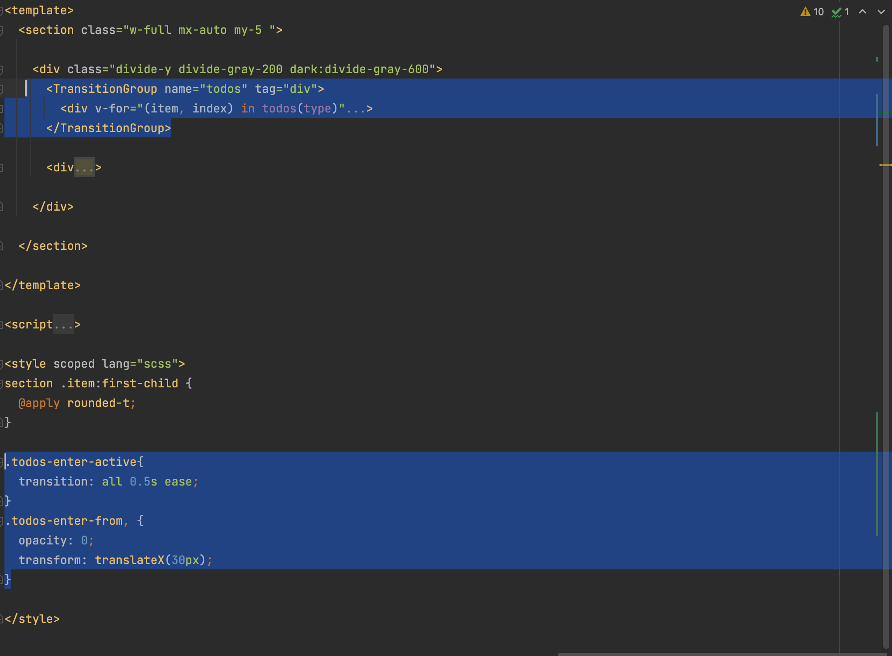

# Todo Application answers

### Technical questions

1. I spent roughly 10 hours on the task. 
 If I had more time on the test I would add
 - Confirmation `notifications` for users action e.g `mark-complete`, `delete todo item`,`clear all complete`
 - I would add individual component tests for the `Header`, `AddTodo` and `Todos` components
 - I would add CI pipelines for the application
2. What I spent most time with was adding the drag and drop feature because I had to research on it since I had not worked with it before. However, it was an interesting task and a good addition to my frontend skills.
3. To monitor production bugs, I would integrate it with an app monitoring technology like sentry
4. Vue 3 introduced TransitionGroup component that can be used to handle transitions in list items. I used it to add entrance animation on addition of an item in the todos list
   
5. The test was really interesting. Including the designs was a good addition

#### APP_URL

The application is hosted on [michael-kamau.github.io]('https://michael-kamau.github.io')
